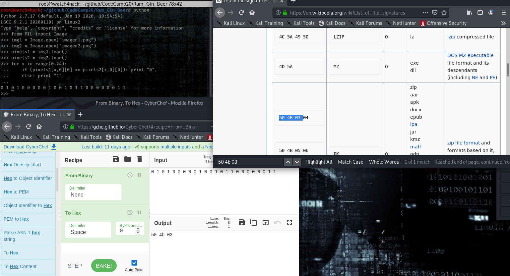
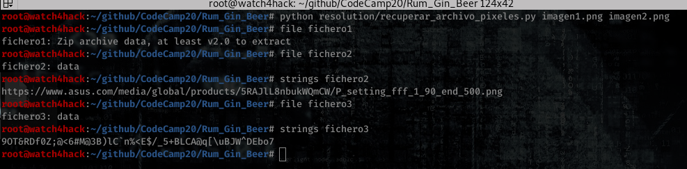
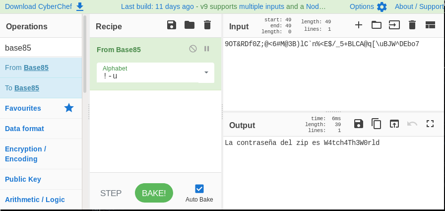
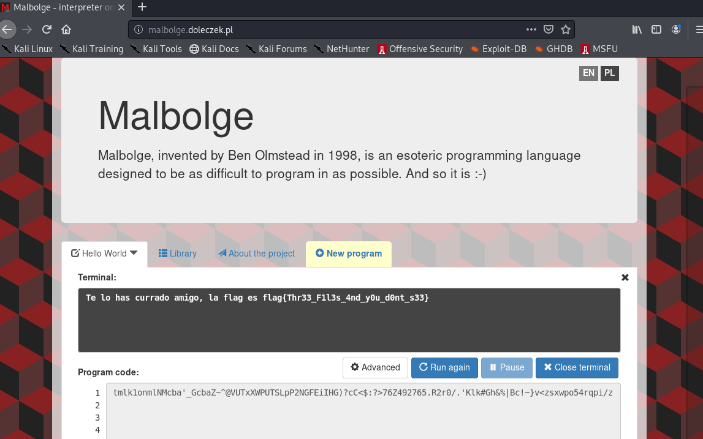

# **Resolución del reto "Rum_Gin_Beer"**

**Pista: "Un pixel esta compuesto por tres canales de datos (atento al nombre del reto), podríamos decir que estáis ante una nueva versión del reto Bitxel2Pit."**

- **1**. Realizamos un "**compare -compose**" a las imágenes para ver en que se diferencian -> *compare -compose src imagen1.png imagen2.png diferencias.png*

- **2**. En la imagen "**diferencias.png**" se puede apreciar que hay datos ocultos en las imágenes.

- **3**. Si analizamos los pixeles de las imagenes, comprobamos que existen diferencias en los valores de los bytes de los colores de los pixeles (RGB), en los bytes que se diferencian el valor cambia solo en 1 bit. Al estar entre un reto de esteganografía podemos caer en que se están ocultando datos en las diferencias entre ambas imágenes.

- **3**. Cuando el valor de uno de los canales de color es distinto representa un 1 en binario, cuando es igual un 0. Si analizamos las diferencias, podemos ver que al parecer el valor Red de los pixeles oculta un zip, por tanto podemos asumir que los otros canales de color llevan otros archivos.

- **4**. Programamos un pequeño programa que recorra ambas imágenes, compare los píxeles y guarde en 3 archivos el resultado de las diferencias de los valores de R G y B de cada pixel (cada canal de color representa un archivo distinto). Siendo un 1 cuando existan diferencias en el pixel y 0 cuando sean iguales.
[recuperar_archivo_pixeles.py](recuperar_archivo_pixeles.py)

- **5**. Obtenemos los 3 archivos y confirmamos que tenemos un zip, un texto con una url y un texto codificado.

- **6**. La url es una imagen de una placa asus B85-Pro. B85 es la pista de que se esta utilizando una base 85. El tercer archivo es la contraseña del zip en base 85.

- **7**. Dentro del zip tenemos un arhivo con otro texto la mar de extraño, el archivo se llama *FuckingCode.txt*. Se trata de un codigo en el lenguaje de programación más dificil *Malbolge*, ejecutamos el codigo y obtenemos la flag.

  **Flag -> flag{Thr33_F1l3s_4nd_y0u_d0nt_s33}**
