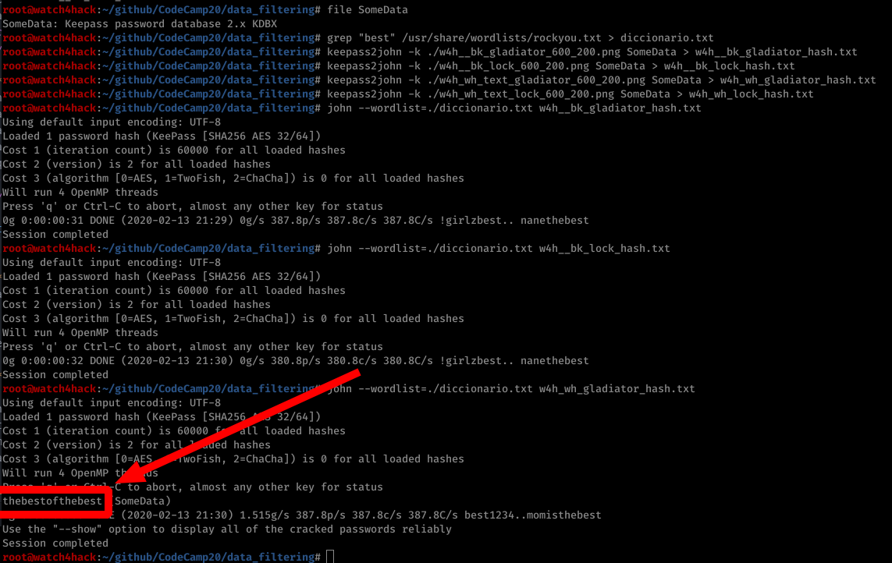
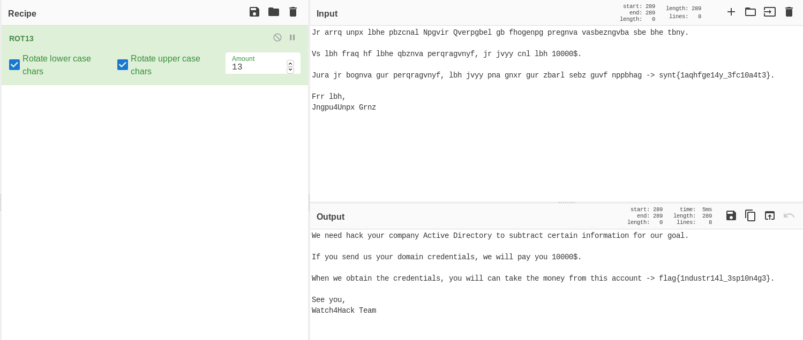

# **Resolución del reto "data_filtering"**

**Pista: "Algunos gestores de contraseñas permiten utilizar archivos y contraseñas para cifrar las credenciales".**

- **1**. Con el comando *file* podemos ver que el archivo **SomeData** de trata de una base de datos de contraseñas de KeePass2. -> *file someData*

- **2**. En la descripción se nos dice que el usuario suele utilizar mucho la palabra **best** en sus contraseñas, creamos un diccionario nuevo basandonos en el diccionario **rockyou**. -> *grep "best" /usr/share/wordlists/rockyou.txt > diccionario.txt*

- **3**. Mediante el uso de *keepass2john* generamos los hash de las posibles contraseñas del archivo KeePass utilizando las imágenes -> *keepass2john -k <archivo_password> SomeData > <archivo_hash>*

- **4**. Utilizamos *john* con el diccionario que hemos creado para intentar obtener la contraseña, utilizando el diccionario que acabamos de crear (probaremos uno a uno los hash hasta que no nos de la password). Con ello obtendremos que la contraseña es **thebestofthebest** -> *john --wordlist=diccionario.txt <archivo_hash>*

- **5**. Abrimos el archivo **SomeData** con *keepass2* utilizando la contraseña y la imagen **w4h_wh_text_lock_600_200.png**. Dentro de este hay varias entradas, unicamente necesitamos la del correo (un gmail real). Durante el CTF, para evitar cambios de contraseñas, o alguna acción malintencionada, se utilizó un doble factor donde el telefono asociado es el de uno de los organizadores.

- **6**. Una vez dentro del correo, encontramos un correo envidado por watch4hack@gmail.com (nuestra cuenta de correo). El mensaje esta cifrado de alguna forma.

- **6**. El cifrado se basa en un ROT13, una vez obtenido el texto en claro tenemos la flag.

  **Flag -> flag {1ndustr14l_3sp10n4g3}**
